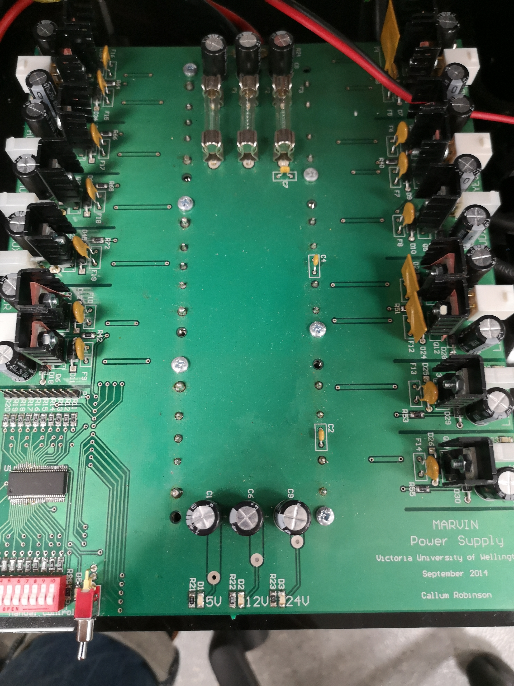

# MARVIN operation MANUAL  
Last edited 02/3/2021, by Saul Ramsay.  
Email: ramsaysaul@myvuw.ac.nz, ramsay.saul@gmail.com  
Github: [5AUL-R](https://github.com/5AUL-R)  
For more detailed logs of troubleshooting and working with MARVIN, the repo can be found at:  
[https://github.com/5AUL-R/MARVIN](https://github.com/5AUL-R/MARVIN) 

## Table of contents
#### 1 [Introduction](#introduction-heading)
#### 2 [MARVIN's Hardware Systems](#hardware-heading)
#### 3 [MARVIN's Software Systems](#software-heading)
#### 4 [Getting Started](#getting-started-heading)
## 1.0 Introduction
#introduction-heading  
Mobile Autonomous Robotic Vehicle for Indoor Navigation V2.0 or MARVIN (V2) for short is a Robot originally designed for use as a prototype security system by Dale Carnegie.  
MARVIN's use as a research tool over time has shifted away from security and more towards Human Robot Interaction.   
The most recent project MARVIN has been utilised for was Callum Robinson's Masters thesis. Callum modified MARVIN's hardware and software systems to suit his change into an HRI platform.

## 1.1 Prerequisite Knowledge
### 1.1.1 Linux and Command Line
This manual will assume you are reasonably familiar with navigating a Linux / Unix desktop environemnt and command terminal (specifically with BASH) and downloading software with the Advanced Package Tool or via cloning a github repository.  
You should be comfortable being able to make, delete, navigate and view directories / files with the terminal. However if you don't the commands for such are `$ mkdir <DIRECTORY NAME>`, `$ rm <FILENAME>` / `$ rm -r <DIRECTORY NAME>`, `$ cd <DIRECTORY / FILE NAME>` and `$ ls` respectively (If you have never used commands, or are very unfamilar in how to use these - see the note below about using commands).  
Additionally you should be comfortable in installing, updating and upgrading software packages via the Advanced Package Tool (APT). I.e. you should be able to comfortably use the commands  `$ sudo apt-get install <PACKAGE NAME>`, `$ sudo apt update` and `$ sudo apt upgrade`.  
However, if you haven't used these commands all you need to know is the APT makes installing software (and all it's subsequent dependencies) much simpler than installing software via source code directly. This is very important with a ROS ecosystem as ROS is designed to be very modular, and when using ROS you can end up with hundreds of packages and as a result even more dependencies! If you were to install it all from source it likely would mean your software wouldn't work at all, wouldn't work well and at the very least will make your project a mess when you want to modifiy / upgrade your systems.  
This is why we use the APT. It makes managing our packages much simpler and easier!  
So when you want to install a package, either for your Linux machine in general, or if it's a ROS package specifically you should check that it can be installed via the APT. There are three ways to check.  
1. It will usually say so on the [ROS Wiki](http://wiki.ros.org/) or github repo for the package  
2. You can check in the terminal. try typing out most of the package name and hit the tab key, this will complete the package name - or display a list of packages that begin with what you have typed (if they exist on the apt database).  
   For example, if I wanted to see I can install the [joy](http://wiki.ros.org/joy) package I would type `$ sudo apt-get ros-indigo-jo` since joy is a package you can isntall via the APT it will autocomplete it. 
3. Sometimes a package will have a very different name to what you might expect, say you are looking for a specific header file that you are missing.  
   The remedy for this is to search the APT database. You can do this by searching on google your package name, and include "ubuntu" with quotations.  
     
When installing a package for ROS we run dependencies we run the command: `$ sudo apt-get install ros-<ROS DISTRO NAME>-<ROS PACKAGE NAME>`

### 1.1.2 Note On Using Commands In This Manual
Any commands that you are to use in the terminal will be in bash and will look like this:  
`$ mkdir hello`    
If the command you are issuing has arguemnts that will be specific to your setup environment, they will look like this:  
`$ mkdir <DIRECTORY NAME>`
You do not need to include the '$' in the command, in fact the command will not work if you do. The dollar sign is simply included to signify it is a bash command to be issued to your terminal.  
    

### 1.1.2 Robot Operating System  
MARVIN's software systems are based around Robot Operating System (ROS).
This manual will assume that you are familiar with the basic operation and structure of ROS software. For example you should already know that everything within ROS has a node, nodes are typically abstracted from the hardware as much as possible, nodes are designed for one specific purpose and communicate via 'subscribing' and 'publishing' to channels reffered to as topics.  

## 2. MARVIN's Hardware Systems
#hardware-heading  
  

MARVIN has 8 main hardware systems:  
1. [Torso control board](#torso-control-board-heading)
2. [Eye RGB driver board](#eye-rgb-driver-board-heading)
3. [Sensor Board](#sensor-board-heading)
4. [Sensors](#sensors-heading)
5. [The Intel Next Unit of Computing (NUC)](#nuc-heading)
6. [The Segway Robotic Mobility Platform (RMP)](#rmp-heading)
7. [Power Distribution board](#power-distribution-board-heading)
8. [The torso and head](#torso-and-head-heading)

Here is a diagram outlining thier connection to one and other.  
  

### 2.1 Torso control board
#torso-control-board-heading  
The torso control board and the [eye RGB driver board](#eye-rgb-driver-board-heading) work in conjuction with eachother. They are connected via a four pin cable (for what seems to be power).  
The toro control board has a mini-USB cable that connects to the NUC via a serial port (in the same fashion as an Arduino type board).   
However, the Torso control board is the only one that communicates with the NUC directly. as the eye RGB driver board does not have any direct connection to the NUC.  
The torso control board has a series of JST connectors that connect to the linear actuator driver in the back of MARVIN's torso. The cables and their respective JST plug on the board have matching labels. At the time of writing for this manual, not all the JST plugs on the torso control board for communication to the linear actuator driver are used.  
  

### 2.2 Eye RGB driver board  
#eye-rgb-driver-board-heading  
The eye RGB driver board controls the colour of MARVIN's eyes, as the name suggests.The board has a 3.5mm audio jack for outputting MARVIN's voice.

### 2.3 Sensor Board  
#sensor-board-heading  
The sensorboard is a PCB 'shield' that sits on top of an arduino MEGA. The sensorboard communicates to the NUC via a usb cable with communication on the serial port via rosserial.  
All of MARVIN's sensors connect to the sensorboard. Most are powered via the sensorboard's 5V power supply from the usb connection to the NUC.   
It should be noted that the sensorboard has a header pin cable that connects to the power distribution board. This cable ensures that the sensorboard is capable of supplying the required current for all of it's constituent sensors.  

### 2. Sensors  
#sensors-heading  
MARVIN is equipped with a selecttion of different sensors. These include:
- Whisker sensors
- IR proximity sensors
- Ultrasonic Proximity sensors

### 2.4 The Intel Next Unit of Computing (NUC)
#nuc-heading  
The NUC is the central computer for MARVIN. it is a miniature desktop PC that runs Ubuntu Linux. MARVIN's 'operating system' is ROS, this sits on top of the true operating system, Ubuntu.  
All of MARVIN's software is within the NUC. This is explained in greater depth in the [software systems](#software-heading) section
### 2.5 The Segway Robotic Mobility Platform (RMP)
#rmp-heading  
MARVIN's locomation is a Segway Robotic Mobility Platform (RMP).  
The segway RMP has its own separate power supply, which means it must be charged when not in use.  
**Emergency stop**  
The RMP has an emergency stop 'deadman' switch which is held in place by a green 3D printed insert attached to a yellow cord. This is designed to be pulled out thus activating the switch should the user require MARVIN's RMP to stop suddenly.  
It's important to ensure this insert is properly fastened, and engaging the deadman switch before attempting to operate the RMP, as the motors will not turn on if the switch isn't engaged.   

The Segway RMP is now a discontinued product, which means it has limited and outdated software support at the time of writing.  
  
  
The RMP control panel, serial connection, emergency stop and charging cable.  
  
### 2.6 Power Distribution board and MARVIN's power distribution system
#power-distribution-board-heading
The power distribution board is not strictly the centralised control for MARVIN's power system. The NUC is powered independantly to the power distribution board via a buck convertor and a battery pack.  
#### **2.6.1 Power requirements and use**
Three 8000mAh, 20V LiPo battery packs are used to fully operate MARVIN without a tether for power. One powers the NUC, two supply power to the power distribution board via a splitter cable, with two pairs of bullet connectors.  
#### **2.6.2 LiPO Safety**
**It should be noted that MARVIN has no capability for battery voltage / charge management and when using LiPO batteries you should have your own system in place for monitoring battery voltage (a screamer circuit for example) and all precautions from the technicians should be strictly adhered to.**  
If anything you have read in this manual about LiPo batteries conflicts with advice from the technicians, listen to the technicians and ignore this manual.  
If you're unsure about *anything* to do with handling and use of LiPo batteries, you should always talk to the technicians.  
LiPo batteries create Hydrogen Flouride gas when they are dropped, used below thier *safe* voltage level, overcharged or punctured. LiPo batteries can also overheat, and subseuqently ignite this gas.  
**Always check the temp of your LiPo batteries before, and during operation.**  
It isn't uncommon for LiPo batteries to heat up a little from use, but anything too hot to touch is unsafe.  
In which case you should place the battery into a LiPo bag and proceed to carry the battery outside and wait for the battery to cool down. You should then inform the technicians immediately    
  
The batteries for MARVIN are carried in a rack just above the RMP. Shown below.  

#### 2.6.2 Power Distribution  
Most of MARVIN's power requirements are handled by the power distribution board (PDB). Shown below.
  

The Segway RMP, the NUC and most of the peripherals connected to the NUC (the xbox 360 controller reciever and the sensorboard) are powered seperatly from the power distribution board. The NUC recieves power from a buck converter, which takes input from one of the batteries as discussed above and shown below.   

   
  
The power distribution board has three power rails: 5V, 12V and 24V.  
Each power rail has a blue LED to indicate power.
The power distribution board has a header pin array near the bottom left corner (just above the IC). This is for connecting to the sensorboard.  

The PDB has three fuses, one for each of its power rails, before use ensure that they are electrically continuous (i.e. they haven't blown).
  
If the 5V rail LED is not on, ensure this head pin array is connected to the sensorboard.
For more information on the PDB see the schematic below.  
  

### 2.7 Torso and head
#torso-and-head-heading  
MARVIN's torso is controlled by a series of linear actuators and subsequently a driver for these linear actuators. Communication from the NUC to the driver for the linear actuators is handled by the [torso control board](#torso-control-board-heading). MARVIN's torso can extend in various directions and subsequently various poses. 
  
MARVIN's torso in its neutral position  

  

MARVIN's head and neck is actuted by two servo motors, these are driven directly from the torso control board. The head is equiped with two RGB eyes and a spotlight.    
  

## 3. MARVIN's Software Systems
#software-heading  
### 3.1 Robot Operating System (ROS)
MARVIN runs Robot Operating System (ROS).  
ROS is designed to be a highly modular and abstracted software ecosystem.
ROS operates on the principle of making things controlled by nodes, every sensor and actuator has its own node that controls it. Additionally, to avoid making software too tightly coupled to the hardware, there is usually a layer of ndoes that abstract between nodes that interface with and / or directly cotrol hardware, and the more high-level nodes responsible for overal control and descision making.  
  
Ros nodes have multiple methdods of communicating, but they primarily work by 'subscribing' and 'publishing' to channels called 'topics'. This framework simplifies the communication between nodes and scales very well.

### 3.2 Software Architecture and hierarchy  
The main node that controls everything MARVIN does is called `marvin_control`.  
This node interfaces with three other control nodes `manual_control`, `interaction_control` and `movement_control`. MARVIN has three nodes that are responsible for the low-level control and interface with hardware these are `segway_rmp_node`, `torso_node` and `rosserial` which each interface with the RMP, torso and power distribution board respectively.

This software architecture and hierarchy is explained in significant detail in Callum Robinson's thesis.
### 3.3 Manual Control of MARVIN
To manually control MARVIN requires the use of an Xbox 360 controller. Once the controller has paired with the reciever, and provided the `joy` node is running, the NUC can recieve signals from the controller. For these recieved signals to do anything however, requres the `manual_control` node to be running as well. For more detail on how to set this up, see the [operation](#operation-heading) section of this manual.

The xbox controller commands are recieved by the `joy` node, the node then publishes commands on the `/joy` topic, which is recieved by `manual_control` as it is a subscriber to this topic. `manual_control` processes these commands and depending on what decision it has made, will pass on a movement command to either `marvin_control/request/movement`, `marvin_control/request/manual` or `movement_control/cmd_vel/manual`.  

If the user is running MARVIN in 'manual control' mode (i.e. they have correctly ran the `marvin_transport` launch file, and no other nodes for sensor / autonomous movement) then the `marvin_control` node should pass on all commands from the joy node to movement.

## 4. Getting Started  
#getting-started-heading  
Here is the step by step process to get MARVIN operational.
### 4.1 Power
First, ensure that there is adequate power supplied to the NUC and the power board.  
You should be able to tell as the NUC will have a blue dot on the it's far left corner to indicate power.  
The power distribution board has a blue LED to indicate power for each of it's three rails (5V, 12V and 24V).  
Once you have ensured that all the blue LEDs are lit you may proceed to the next step.
### 4.2 Establish a method of control
MARVIN runs ROS on top of a desktop computer environment, this means he can be controlled via two methods. You can either establish an SSH connection with marvin, this gives you terminal access, which should be adequate for use in the field.  
Alternatively, you can control MARVIN with a full desktop environment (connect a monitor, mouse and keyboard, and use MARVIN as you would with any other dekstop PC). This method is not preferable when using the RMP as MARVIN is esentially tethered to your workstation and you run the risk of pulling wires and damaging MARVIN.  
However, this method is neccessary for quick acces to the desktop and if you need acces to GUI applications.  

#### 4.2.1 Establish SSH
##### 4.2.2 First time setup for SSH
To do this for the first time you will have to setup MARVIN with a full desktop environment. To find out how to do so, see th guide below.  
To establish an ssh connection with MARVIN the first thing you will need to do is find the IP address for the NUC.  
This can be done by setting up the NUC with a display, keyboard and mouse.  
Once you are logged into the dekstop, opena terminal and run:  
`$ ifconfig`  
This will display all the information for all the network adaptors connected to the NUC.  
What we care about is the IP address of the wireless adaptor, this should be next to the section titled wLan0 and next to the field: `inet addr:`  
Write this IP address down.  
Connect the NUC to the wifi network you intend to use for SSH, then shut down the NUC, disconnect the keyboard mouse and any other cables connected to MARVIN.  
You may now proceed to connecting to MARVIN via SSH.  
##### 4.2.3 Establishing an SSH Connection
Once you have got the IP address for the NUC, make sure both the NUC and the control laptop are on and connected to the same wifi network.  
On your control laptop run:  
` ssh marvin@<IP ADDRESS>`  
With "<IP ADDRESS>" being the IP address for the NUC you found in the step above.  
If your connection was sucessful you will either see the terminal ask for a "y/n" response, enter `$ y` or you will see your terminal switch to MARVIN, congratulations!  
If the response from the SSH command takes more than a few seconds this typically means there isn't a connect, in which case you can save yourself the hassle of waiting by killing the process, press ctrl + c. And re-run the command.  
If this doesn't work, or you get for example "connection refused" ensure that the NUC is turned on and connected to the same network the control laptop is connected to. (You will have to connect a keyboard and mouse to the NUC to ensure this.  
If you continue to have trouble connecting try restarting both the NUC and the control Laptop.
   
#### 4.2.2 Establish a full desktop environment
To establish a full desktop environment you must connect a mini-HDMI cable to the min-HDMI port. The NUC has been set to default video output to the min-HDMI port rather than the Display port.  
Additionally you may find it useful to plug in a keyboard and mouse.
### 4.3 Turning on the RMP
First, MARVIN needs to be powered on.  
The Segway RMP has a seperate power supply from the rest of MARVIN's systems, so this is the first thing that needs to be turned on.  
To turn on the RMP, you must press and hold the green power button for three seconds this turns on the control system for the RMP.  
Once the green button has lit up, you must press the yellow power button for three seconds, this turns on the motors once the yellow button has lit up you should hear some fans whir - this means the motors have been activated.   
If the yellow button does not light up after pressing it for three seconds, ensure the fail safe button is fully pressed down. This is usually secured by a 3D printed green latch with a yellow cor attached.  
The final step to turn on the balance mode setting (the blue button on the bottom right). This is required as the RMP is not capable of moving from tractor mode into an upright position.  
The RMP must be lifted so that it is standing upright, while continuing to lift the RMP you must press and hold the balance mode button for three seconds. You will know if you have done this correctly, as the RMP will beep and should be standing on it's own.  
### 4.4 Startup commands  
After you have supplied power, turned on the NUC and RMP and established a connection (via with SSH or direct desktop) you can now start controlling MARVIN.  
The first command to issue is:  
`$ roscore`  
This is the core command for ROS, and starts up nodes for essential ROS services.  
Once you have run `roscore` succesfully you can start launching your wanted nodes. You have two options for how you do this:  
1. You can launch individual nodes directly. This isn't ideal if you're testing a lot of nodes and in MARVIN's case this happens often when testing even basic fuctionality.  
2. You can run launch files.     

To run a launch file run the command:  
`$ roslaunch marvin_control <LAUNCH FILE NAME>`
In the directory: marvin/catkin_ws/src/marvin_control/  
You will find the launch files for MARVIN. There is a range of launch files for testing various aspects of functionality.  

#### 4.4.1 Launch files
MARVIN has a range of launch files for testing various aspects of functionality.  
 - `control.launch`
 - `gui_communication.launch`
 - `human_interaction.launch`
 - `interaction_control.launch`
 - `interaction_control_demo.launch`
 - `interactive_poses.launch`
 - `manual_control.launch`
 - `marvin_control.launch`
 - `marvin_full.launch`
 - `marvin_transport.launch`
 - `movement_control.launch`
 - `movement_control_manual.launch`
 - `movement_control_navigation.launch`
 - `navigation_test.launch`
 - `power_control.launch`
 - `segway_control.launch`  
Most of these launch files will not be explained in this manual as they either depend heavily on the use and / or testing of hardware that no longer exists on MARVIN, or it is not very clear what they were used for.  
  
The most important launch files are:  
- `marvin_full.launch`
   This launch file starts all nodes for full functionality of MARVIN. At the time of writing, this launh file results in runtime errors, due to missing hardware.

- `marvin_transport.launch`  
  This launch file is the only one the user will require for moving MARVIN around manually as it only launches essentially nodes for RMP control.

### 4.5 Operation  
#operation-heading  
To control MARVIN's movement manually, you will need to ensure the xbox 360 controller is turned on. 

Provided the user has followed the above steps corectly, MARVIN should respond to commands from the controller.

At full functionality* MARVIN can move linearly back and forward, and twist.  
The manual control can be toggled on and off with 'X' and 'Y' buttons. And movemmjent can be toggled on and with the 'A' and 'B' buttons respectively. 

Below you will find the control scheme.   
  
*At the time of writing, MARVIN is currently unable to engage in twisting motion.  
It is suspected this is to do with removing the Kinect 2 sensor. As it plays an important role in the control flow from command to movement.
